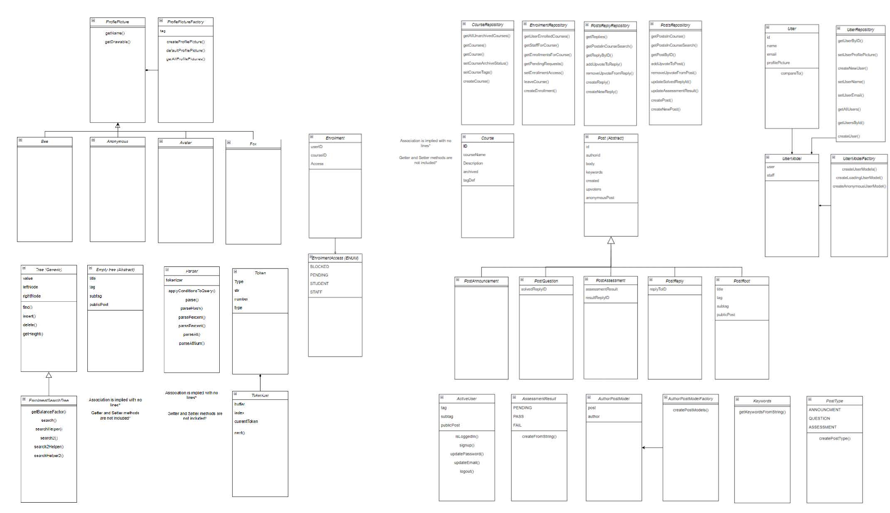
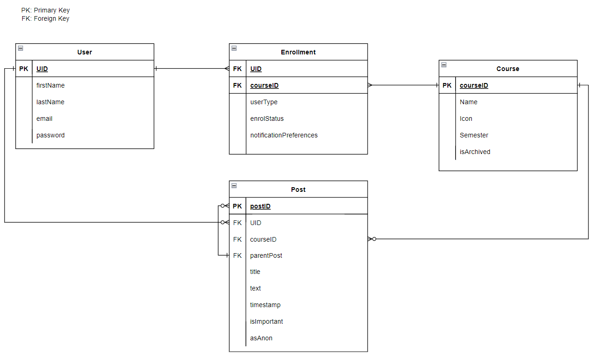

# 🛠️ Technical Documentation

This document outlines the technical details of the Quirkus-Edu-App, including application design, UML diagrams, design patterns, data structures, testing, continuous integration (CI) setup, and implemented features.

---

## 📑 Table of Contents

1. [📊 Application UML](#-application-uml)
2. [🎨 Application Design and Decisions](#-application-design-and-decisions)
   - [Design Patterns Used](#design-patterns-used)
   - [Data Structures](#data-structures)
3. [🛠️ Design Patterns](#-design-patterns)
   - [Single Source of Truth](#single-source-of-truth)
4. [🧩 Grammar(s)](#-grammars)
   - [Production Rules](#production-rules)
   - [Examples](#examples)
5. [🧪 Tokenizer and Parser](#-tokenizer-and-parser)
6. [🔍 Surprise Item](#-surprise-item)
7. [🚀 Continuous Integration (CI)](#-continuous-integration-ci)
8. [🧪 Testing Summary](#-testing-summary)
   - [TokenizerTest](#tokenizertest)
   - [ProfilePictureFactoryTest](#profilepicturefactorytest)
   - [EnrolmentSearchTreeTest](#enrolmentsearchtreetest)
   - [AssessmentResultTest](#assessmentresulttest)
   - [KeywordsTest](#keywordstest)
   - [PostRootModelTest](#postrootmodeltest)
   - [PostTypeTest](#posttypetest)
   - [UserModelFactoryTest](#usermodelfactorytest)
   - [Overall Application Testing](#overall-application-testing)
9. [🚀 Implemented Features](#-implemented-features)
   - [LMS Integration](#lms-integration)
   - [Core Features](#core-features)
10. [General Features](#general-features)
    - [Firebase Integration](#firebase-integration)
    - [Privacy Features](#privacy-features)
    - [Process Management](#process-management)
    - [Search Features](#search-features)
    - [User Interactivity](#user-interactivity)

---

## 📊 Application UML

### Class Diagram

### Database Diagram

---

## 🎨 Application Design and Decisions

### Design Patterns Used:

1. **Observer Pattern**
   - **Objective:** Create reactivity across all components.
   - **Locations:** `LiveSearch.java`, `FirestoreLiveDataDocument.java`, and `FirestoreLiveDataList.java`
   - **Reasons:**
     - Keeps everything in sync throughout the app.

2. **State Pattern**
   - **Objective:** Reference the current logged-in user throughout the app.
   - **Location:** `ActiveUser.java`
   - **Reasons:**
     - Provides components easy access to the current user’s `FirebaseId` and functions such as sign-in, sign-out, and user detail updates.

3. **Factory Pattern**
   - **Objective:** Allows subclasses to change the type of objects created.
   - **Locations:** `ProfilePictureFactory.java`, `UserModelFactory.java`, and `AuthorPostModelFactory.java`
   - **Reasons:**
     - Simplifies supporting and introducing new types into the codebase without breaking existing functionality.

---

### 🗂️ Data Structures

1. **AVL Tree:**
   - **Class:** `EnrolmentSearchTree` extends `Tree<User>`
   - **Objective:** Efficient searching of users.
   - **Key Methods:** `insert`, `find`, `delete`, `search`, `search2`, `leftRotate`, and `rightRotate`.
   - **Benefits:**
     - Efficient operations (O(log n)).
     - Ordered structure for searching users by name.
     - Scalability for large user bases.

2. **Lists:**
   - Used for general data storage in the app.

---

## 🛠️ Design Patterns

- **Factory Method:** Implemented for layouts and designs (e.g., `createLoadingUserModel`) and integrated with Firebase.
- **Observer Pattern:** Ensures asynchronous behavior across components.
- **State Pattern:** Maintains the state of the current user, ensuring seamless user interaction.

### **Single Source of Truth:**
   - **Firebase:** Used for storing the latest data, ensuring consistency across components.
   - **Locations:** `FirestoreLiveDataDocument.java`, `FirestoreLiveDataList.java`
   - **Reasons:**
     - Reduces bugs by keeping all components in sync with the database.
     - Allows easy refactoring of data structures via a repository design pattern.

---

## 🧩 Grammar(s)

### **Production Rules:**
- S ::= S ' ' E | E
- E ::= ' ' E | '#' TAG | '@' CREATED | '%' P

### **Post Types (Only One Allowed):**
- `P` : 'QUESTION' | 'ANNOUNCEMENT'

### **Time Created (Only One Allowed):**
- `CREATED` : '..' Time | Time '..' | Time '..' Time

### **Post Tags:**
- `TAG` : WORD | WORD '-' WORD

### **Time String (Extensible):**
- `Time`: Number `TDist` | Number `TSep` Number
- `TDist`: s | m | h | d | w | M
- `TSep`: '/' | '-'

#### **Examples:**
- `help with parser #general %question @..1w`
- `help with parser #Assignments-A1 %question @2/3..5/3`

---

## 🧪 Tokenizer and Parser

### **Key Classes:**
- **Token Class:** Represents a single token in the input search string (strings, numbers, or special characters like #, @, %, etc.).
- **Tokenizer Class:** Breaks down input into tokens for lexical analysis.
- **Parser Class:** Interprets tokens into a Firestore query based on predefined rules.

### **Benefits:**
- **Flexibility:** Supports various parameters (tags, post types, time ranges).
- **User-Friendly:** Simplifies the search experience for users.
- **Scalability:** Handles large datasets efficiently with Firestore queries.
- **Precision:** Allows precise search results based on user input.

---

## 🔍 Surprise Item

### **Process Workflow:**
1. Submit assessment piece with text or link (e.g., OneDrive).
2. Tutor reviews and provides feedback.
3. Staff posts an announcement when all assessments are marked.
4. User searches for their assessment using `%ASSESSMENT`.
5. User can respond and dispute feedback via chat.
6. Tutor updates the result with feedback as needed.

---

## 🚀 Continuous Integration (CI)

A CI job was set up to build the app and run tests on every commit. This ensured:
- Passing tests and error-free code on every merge.
- Safe merges, particularly for testing, syntax checks, and code stability.

---

## 🧪 Testing Summary

### **TokenizerTest:**
- **Purpose:** Ensures the application can correctly parse and interpret user input.
- **Relevance:** Crucial for search queries, commands, and hashtags in a forum.

### **ProfilePictureFactoryTest:**
- **Purpose:** Ensures correct association between users and their profile pictures, including handling defaults.

### **EnrolmentSearchTreeTest:**
- **Purpose:** Verifies the search and insertion functionality of users in the AVL tree structure.

### **AssessmentResultTest:**
- **Purpose:** Validates the system’s ability to handle assessment results, including edge cases.

### **KeywordsTest:**
- **Purpose:** Ensures correct keyword identification for tagging and searching posts.

### **PostRootModelTest:**
- **Purpose:** Ensures accurate creation and retrieval of posts with associated metadata.

### **PostTypeTest:**
- **Purpose:** Validates handling of different post types (e.g., questions, announcements).

### **UserModelFactoryTest:**
- **Purpose:** Ensures correct creation and management of user models.

### **Overall Application Testing:**
- **Purpose:** Comprehensive testing to ensure proper functionality across all features.

---

## 🚀 Implemented Features

### **LMS Integration:**
- Discord-style threaded replies.
- Piazza-style learning management system (LMS).

### **Core Features:**
1. **Login/Signup**
   - **Classes:** `LoginActivity.java`, `Enrollment.java`, `EnrollmentsModel.java`, etc.
2. **Data Visualization**
   - **Source:** Firebase.
3. **Search Functionality**
   - **Classes:** `Parser.java`, `Tokenizer.java`, `SearchC.java`, `SearchF.java`.
4. **Data Handling**
   - **Source:** Firebase.

---

### **General Features:**

#### **Firebase Integration:**
1. **FB-Auth:** User authentication (easy).
2. **FB-Persist:** Data persistence in Firebase (medium).
3. **FB-Sync:** Real-time updates using Firebase Firestore (hard).

#### **Privacy Features:**
1. **Join Course Requests (easy)**
   - **Classes:** `Requests.java`, `RequestModel.java`.
2. **Visibility Control (easy)**
   - Students can only see enrolled courses.
3. **Block/Private Posts (medium)**
   - Allows tutors to make posts private.
4. **Anonymous Posts (medium)**
   - Anonymity for forum posts, visible to staff only.

#### **Process Management:**
1. **Permission Controls (easy)**
   - **Classes:** `Enrollment.java`, `EnrollmentsModel.java`, etc.
2. **Thread Interactions (easy)**
   - **Files:** Whole app.
3. **User Signup (hard)**

#### **Search Features:**
1. **Search Filters (easy)**
   - Course-specific search filters.

#### **User Interactivity:**
1. **Micro-interactions (easy)**
   - Forums and threads.

---